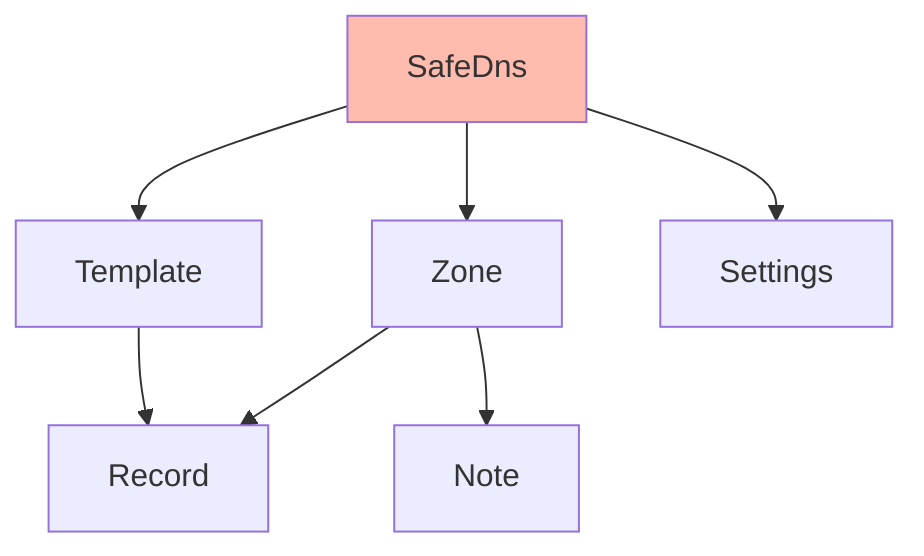

# SafeDNS
Wrapper around the UKFast SafeDNS API.<br>
[API Documentation](https://developers.ukfast.io/documentation/safedns)

## Heirarchy


<br>
## Getting Started

Creating the SafeDNS object:
```python
from UKFastAPI.SafeDNS import SafeDns
safedns = SafeDns('API_TOKEN')
```