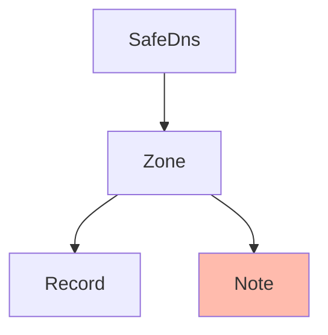

# SafeDNS Note
[API Documentation](https://developers.ukfast.io/documentation/safedns#/Notes)

## Heirarchy

<br>
#### Listing Note
```python
# Subject to pagination.
notes = zone.notes.list()

# Bypass pagination.
notes = zone.notes.list(all=True)
```

#### Getting a Note
```python
note = zone.notes.get('my-note')
```

#### Creating a Note
```python
note = zone.notes.create(
    name="ukfast.co.uk",
    zone="ukfast.co.uk",
    type="MX",
    content="203.0.113.1",
    ttl=86400,
    priority=10
)
```

#### Updating a Note
```python
note.name="ukfast2.co.uk",
note.zone="ukfast2.co.uk",
note.type="MX",
note.content="203.0.113.2",
note.ttl=80400,
note.priority=20
note.save()
```

#### Deleting a Note
```python
note.delete()
```