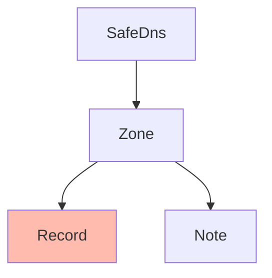

# SafeDNS Record
[API Documentation](https://developers.ukfast.io/documentation/safedns#/Records)

## Heirarchy

<br>
#### Listing Records
```python
# Subject to pagination.

# Zone example
records = zone.records.list()

# Template example
records = template.records.list()


# Bypass pagination.

# Zone example
records = zone.records.list(all=True)

# Template example
records = template.records.list(all=True)
```

#### Getting a Record
```python
# Zone example
record = zone.records.get('my-record')

# Template example
record = template.records.get('my-record')
```

#### Creating a Record
```python
# Zone example
record = zone.records.create(
    name="ukfast.co.uk",
    zone="ukfast.co.uk",
    type="MX",
    content="203.0.113.1",
    ttl=86400,
    priority=10
)

# Template example
record = zone.records.create(
    name="ukfast.co.uk",
    zone="ukfast.co.uk",
    type="MX",
    content="203.0.113.1",
    ttl=86400,
    priority=10
)
```

#### Updating a Record
```python
record.name="ukfast2.co.uk",
record.zone="ukfast2.co.uk",
record.type="MX",
record.content="203.0.113.2",
record.ttl=80400,
record.priority=20
record.save()
```

#### Deleting a Record
```python
record.delete()
```