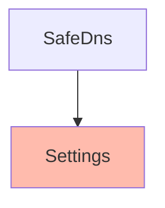

# SafeDNS Note
[API Documentation](https://developers.ukfast.io/documentation/safedns#/Settings)

## Heirarchy

```mermaid
graph TD
    SafeDns --> Settings
    style Settings fill:#ffbbad
```
<br>
#### Get Settings
```python
settings = safedns.settings
```