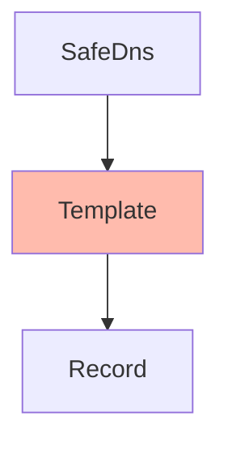

# SafeDNS Templates
[API Documentation](https://developers.ukfast.io/documentation/safedns#/Templates)

## Heirarchy

<br>
#### Listing Templates
```python
# Subject to pagination.
templates = safedns.templates.list()

# Bypass pagination.
templates = safedns.templates.list(all=True)
```

#### Getting a Template
```python
template = safedns.templates.get('my-template')
```

#### Creating a Template
```python
template = safedns.templates.create(name='my-template', default=True)
```

#### Updating a Template
```python
template.description = 'My new description.'
template.default = False
template.save()
```

#### Deleting a Template
```python
template.delete()
```