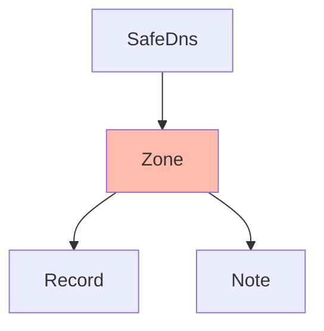

# SafeDNS Zones
[API Documentation](https://developers.ukfast.io/documentation/safedns#/Zone)

## Heirarchy


<br>
#### Listing Zones
```python
# Subject to pagination.
zones = safedns.zones.list()

# Bypass pagination.
zones = safedns.zones.list(all=True)
```

#### Getting a Zone
```python
zone = safedns.zones.get('my-zone')
```

#### Creating a Zone
```python
zone = safedns.zones.create(name='my-zone', description='My first zone.')
```

#### Updating a Zone
```python
zone.description = 'My new description.'
zone.save()
```

#### Deleting a Zone
```python
zone.delete()
```